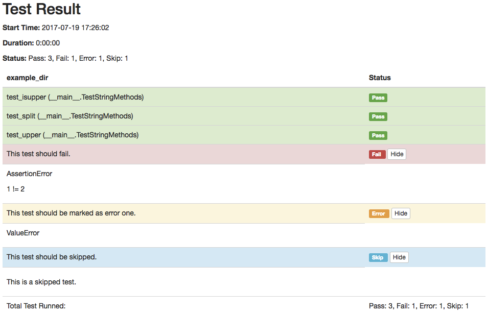

# PyUnitReport

PyUnitReport is a unittest test runner that save test results in Html files, for human readable presentation of results.

## Installation

To install PyUnitReport, run this command in your terminal:

```bash
$ pip install git+https://github.com/debugtalk/PyUnitReport.git#egg=PyUnitReport
```

## Usage

### testcase

```python
import PyUnitReport
import unittest

class TestStringMethods(unittest.TestCase):
    """ Example test for HtmlRunner. """

    def test_upper(self):
        self.assertEqual('foo'.upper(), 'FOO')

    def test_isupper(self):
        self.assertTrue('FOO'.isupper())
        self.assertFalse('Foo'.isupper())

    def test_split(self):
        s = 'hello world'
        self.assertEqual(s.split(), ['hello', 'world'])
        # check that s.split fails when the separator is not a string
        with self.assertRaises(TypeError):
            s.split(2)

    def test_error(self):
        """ This test should be marked as error one. """
        raise ValueError

    def test_fail(self):
        """ This test should fail. """
        self.assertEqual(1, 2)

    @unittest.skip("This is a skipped test.")
    def test_skip(self):
        """ This test should be skipped. """
        pass

if __name__ == '__main__':
    unittest.main(testRunner=PyUnitReport.HTMLTestRunner(output='example_dir'))
```

Just import `PyUnitReport` from package, then pass it to `unittest.main` with the `testRunner` keyword. This class have only one required parameter, with is `output` this is use to place the report of the TestCase, this is saved under a `reports` directory.

### testsuite

For those who have `test suites` it works too, just create a runner instance and call the run method with your suite.

Here is an example:

```python
from unittest import TestLoader, TestSuite
from PyUnitReport import HTMLTestRunner
import ExampleTest
import Example2Test

example_tests = TestLoader().loadTestsFromTestCase(ExampleTests)
example2_tests = TestLoader().loadTestsFromTestCase(Example2Test)

suite = TestSuite([example_tests, example2_tests])

runner = HTMLTestRunner(output='example_suite')

runner.run(suite)
```

## Output

### Console output

This is an example of what you got in the console.

```text
$ python examples/testcase.py
Running tests...
----------------------------------------------------------------------
 This test should be marked as error one. ... ERROR (0.000596)s
 This test should fail. ... FAIL (0.000616)s
 test_isupper (__main__.TestStringMethods) ... OK (0.000109)s
 This test should be skipped. ... SKIP (0.000064)s
 test_split (__main__.TestStringMethods) ... OK (0.000178)s
 test_upper (__main__.TestStringMethods) ... OK (0.000153)s

======================================================================
ERROR [0.000596s]: This test should be marked as error one.
----------------------------------------------------------------------
Traceback (most recent call last):
  File "examples/testcase.py", line 23, in test_error
    raise ValueError
ValueError

======================================================================
FAIL [0.000616s]: This test should fail.
----------------------------------------------------------------------
Traceback (most recent call last):
  File "examples/testcase.py", line 27, in test_fail
    self.assertEqual(1, 2)
AssertionError: 1 != 2

----------------------------------------------------------------------
Ran 6 tests in 0:00:00

FAILED
 (Failures=1, Errors=1, Skipped=1)

Generating HTML reports...
Template is not specified, load default template instead.
Reports generated: /Users/Leo/MyProjects/ApiTestEngine/src/pyunitreport/reports/example_dir/2017-07-19-17-26-02.html
```

### Html Output



